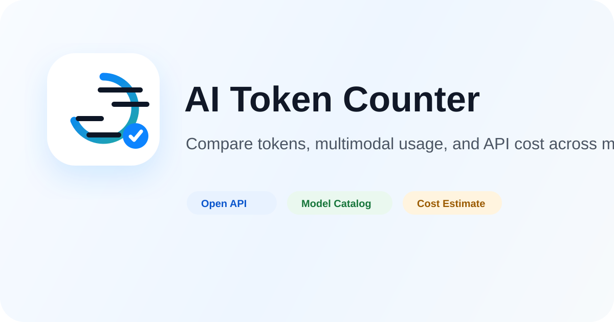
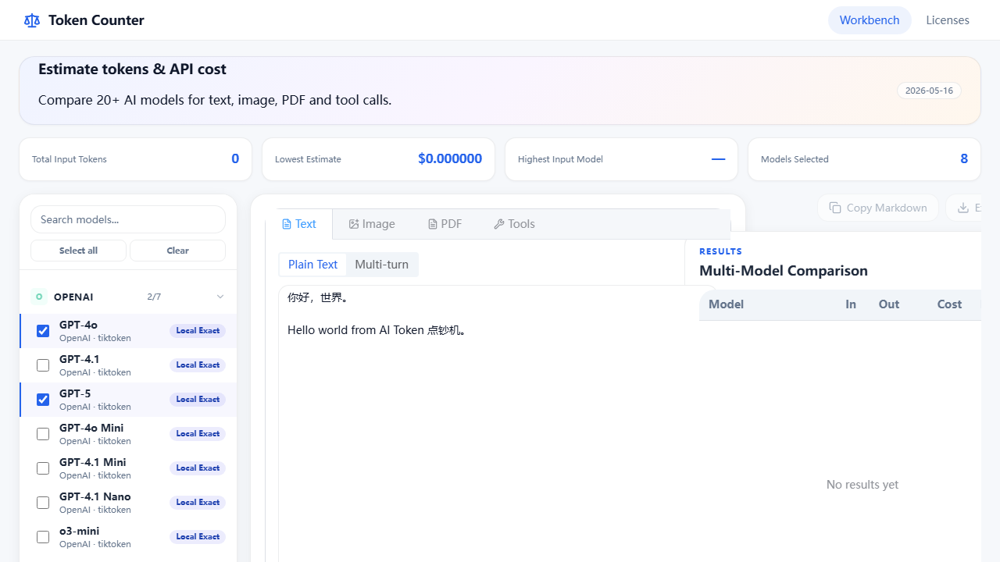

# AI Token Counter

<p align="center">
  
</p>

<p align="center">
  <a href="https://github.com/Shiaoming123/Tokens-Counter"></a>
  
  
  
  
  
  <a href="https://github.com/Shiaoming123/Tokens-Counter/actions/workflows/ci.yml"></a>
</p>

<p align="center">
  <strong>English</strong>
  ·
  <a href="./README.zh-CN.md">
    
  </a>
</p>

<p align="center">
  <a href="https://tokens-counter.vercel.app"><strong>Try Web Demo</strong></a>
  ·
  <a href="https://tokens-counter.vercel.app/early-access"><strong>Request Early Access API Key</strong></a>
  ·
  <a href="https://tokens-counter.vercel.app/trust"><strong>Trust Center</strong></a>
  ·
  <a href="https://tokens-counter.vercel.app/case-studies"><strong>Case Studies</strong></a>
  ·
  <a href="#external-api"><strong>API Quickstart</strong></a>
  ·
  <a href="#trust-boundary"><strong>Trust Boundary</strong></a>
</p>

AI Token Counter is a model-aware token and API cost estimation workbench for teams comparing LLM prompts, multimodal inputs, PDFs, tool definitions, model pricing, and tokenizer accuracy across providers.

It is built for one practical question:

> "If I send this input to different AI models, how many tokens will it use, how much might it cost, and how trustworthy is the estimate?"

## Early Access

The hosted workbench is available now: [tokens-counter.vercel.app](https://tokens-counter.vercel.app).

Hosted API keys are currently issued manually through [Early Access](https://tokens-counter.vercel.app/early-access). This is the right path if you want to:

- add token and cost estimates to an internal tool,
- compare provider and proxy pricing before shipping an AI workflow,
- audit prompt, PDF, image, or tool-schema overhead across models,
- test the API contract before requesting custom pricing profiles or private deployment support.

Early Access keys use conservative limits while API key management, persistent quota, and billing are hardened.

## Trust Boundary

For the hosted product view, see the [Trust Center](https://tokens-counter.vercel.app/trust).

- Local browser estimates stay local unless you enable official provider counting.
- Official counting can send prompts, messages, images, PDFs, or tool schemas to the selected provider API through your server-side keys.
- Token and cost estimates are planning data, not provider invoices.
- Closed-source models, multimodal inputs, tool calls, caching, and provider optimizations can change final billable usage.
- Public hosted API access requires a bearer key and rate limits; do not embed long-lived keys in browser code.

## 中文简介

AI Token Counter，也就是这个项目里的「Token 点钞机」，用于对比主流 AI 模型的文本、图片、PDF、工具调用 Token 数量和 API 费用。它会明确区分官方计数、本地精确 tokenizer、本地估算和不支持的能力，避免把闭源模型的第三方估算误标成官方结果。

当前仓库采用 [MIT License](./LICENSE) 开源。第三方 tokenizer、模型、provider API 和价格来源仍遵循各自的许可证和服务条款。

## Contents

- [Highlights](#highlights)
- [Early Access](#early-access)
- [Trust Boundary](#trust-boundary)
- [Screenshots](#screenshots)
- [When To Use It](#when-to-use-it)
- [Accuracy Model](#accuracy-model)
- [Supported Providers](#supported-providers)
- [Quick Start](#quick-start)
- [Environment Variables](#environment-variables)
- [External API](#external-api)
- [Project Structure](#project-structure)
- [Adding A New Model](#adding-a-new-model)
- [Privacy And Security](#privacy-and-security)
- [Roadmap](#roadmap)
- [Contributing](#contributing)
- [Commercial Use](#commercial-use)
- [License](#license)

## Highlights

- **198 model catalog entries** across OpenAI, Anthropic, Google, DeepSeek, Qwen, GLM/Z.AI, Mistral, Meta Llama, xAI, Cohere, Baidu ERNIE, Doubao, Moonshot/Kimi, StepFun, MiniMax, and Xiaomi MiMo.
- **Text, image, PDF, and tool-call inputs** in one workspace.
- **Accuracy labels for every result**: official exact, official estimate, local exact, local estimate, or unsupported.
- **Provider-aware image handling**: when images are uploaded, models without vision capability are disabled in the selector.
- **Pricing profiles**: use the official/catalog pricing profile or the CC Switch-style preset profile when proxy/coding-tool billing differs.
- **External API v1** for `/api/v1/models`, `/api/v1/estimates`, and `/api/v1/tokens/count`.
- **Apple-style UI theme** with dark/light mode, provider logos, drawer comparison view, local history, Markdown copy, and CSV export.
- **Privacy-first default**: local estimates stay in the browser unless the user enables official provider counting APIs.

## Screenshots

<p align="center">
  
</p>

If the screenshot is outdated after UI changes, replace `screenshot.png` before publishing.

## When To Use It

Use this project when you need to:

- compare prompt cost before choosing a model,
- estimate text/image/PDF/tool-call token usage,
- check whether a model supports a requested input mode,
- compare official pricing and proxy/coding-tool pricing,
- expose token counting and cost estimates to internal tools through an API,
- audit tokenizer assumptions before using estimates commercially.

## Accuracy Model

Token estimation is not one uniform problem. The app intentionally separates methods:

| Accuracy | Meaning |
| --- | --- |
| `official_exact` | Provider API returns an exact count for the requested payload. |
| `official_estimate` | Provider API returns a documented estimate or a model-side count that can differ from final billed usage. |
| `local_exact` | The app has an explicit local tokenizer implementation or mapped tokenizer asset for raw text. |
| `local_estimate` | The app uses a family tokenizer, local heuristic, or formula-based estimate. |
| `unsupported` | The selected model does not support that input capability. |

Important caveats:

- Chat templates, tool/function schemas, system messages, cached tokens, and provider-side optimizations can change final API usage.
- Image/video/PDF counting is especially provider-specific.
- Pricing changes frequently; always confirm with the provider before using estimates for billing or procurement.

See [Tokenizer Mapping And License Audit](./docs/tokenizer-research-2026-05-17.md) for the latest tokenizer research notes.

## Supported Providers

| Provider | Model entries | Counting approach |
| --- | ---: | --- |
| OpenAI | 60 | `js-tiktoken`, official count API fallback, image formulas |
| Anthropic Claude | 24 | official `count_tokens` API |
| Google Gemini | 11 | official `countTokens` API plus local image fallback |
| DeepSeek | 9 | mapped Hugging Face tokenizer assets where available |
| Alibaba Qwen | 19 | mapped Qwen tokenizer assets for open models; hosted aliases marked conservatively |
| Z.AI / GLM | 10 | official tokenizer API path |
| Xiaomi MiMo | 6 | mapped open checkpoint tokenizer where available |
| Mistral | 11 | local estimate until `mistral-common` integration |
| Meta Llama | 4 | local estimate with model-license warnings |
| xAI Grok | 10 | local estimate until official tokenize API integration |
| Cohere | 4 | official tokenize API for supported models; local fallback elsewhere |
| Baidu ERNIE | 5 | mapped ERNIE tokenizer asset |
| ByteDance / Doubao | 6 | local estimate until official calculator integration |
| Moonshot / Kimi | 9 | local estimate until official estimate API integration |
| StepFun | 2 | official token-count API for supported models |
| MiniMax | 8 | local estimate; official image count where required |

## Tech Stack

- Frontend: Vue 3, TypeScript, Vite, Pinia, Element Plus, Lucide Icons
- API server: Hono on Node.js
- Tokenizers: `js-tiktoken`, lightweight Hugging Face tokenizer loader, provider-specific estimate rules
- Documents and images: `pdfjs-dist`, browser-side image metadata extraction
- Tests: Vitest

## Quick Start

Requirements:

- Node.js 24 or newer is recommended for the current local setup.
- npm is used by the checked-in lockfile.

```bash
git clone git@github.com:Shiaoming123/Tokens-Counter.git
cd Tokens-Counter
npm install
cp .env.example .env
npm run dev
```

Default local URLs:

- Web: `http://localhost:5173`
- API: `http://localhost:8787`

The Vite dev server proxies `/api/*` to the local Hono server.

## Environment Variables

```bash
# Server
PORT=8787
TOKEN_COUNTER_API_KEY=
TOKEN_COUNTER_API_KEYS=
TOKEN_COUNTER_RATE_LIMIT_MAX=120
TOKEN_COUNTER_RATE_LIMIT_WINDOW_MS=3600000

# Public repository link used by the header GitHub icon
VITE_APP_GITHUB_URL=https://github.com/Shiaoming123/Tokens-Counter

# Official count APIs
OPENAI_API_KEY=
ANTHROPIC_API_KEY=
GEMINI_API_KEY=
ZAI_API_KEY=
ZHIPU_API_KEY=
COHERE_API_KEY=
MOONSHOT_API_KEY=
STEPFUN_API_KEY=
XAI_API_KEY=
```

Notes:

- API keys must stay server-side. Do not expose provider keys in client code.
- Without official provider keys, the app falls back to local counting where possible and marks results accordingly.
- `TOKEN_COUNTER_API_KEY` protects the external `/api/v1/*` API when configured. Use comma-separated `TOKEN_COUNTER_API_KEYS` for simple rotation or multiple clients.
- `TOKEN_COUNTER_RATE_LIMIT_MAX` and `TOKEN_COUNTER_RATE_LIMIT_WINDOW_MS` control the in-memory per-key/IP external API limiter.

## Common Commands

```bash
# Start frontend and API together
npm run dev

# Start only Vite
npm run dev:web

# Start only Hono API
npm run dev:api

# Run tests
npm test

# Type-check and build production assets
npm run build

# Validate model/pricing/license catalog integrity
npm run validate:catalog

# Serve the API and built frontend from dist/
npm start
```

## External API

The public API surface is versioned under `/api/v1`.

```bash
export BASE_URL="https://tokens-counter.vercel.app"
export TOKEN_COUNTER_API_KEY=<your-api-key>

curl "$BASE_URL/api/v1/models" \
  -H "Authorization: Bearer $TOKEN_COUNTER_API_KEY"
```

```bash
curl "$BASE_URL/api/v1/estimates" \
  -H "Authorization: Bearer $TOKEN_COUNTER_API_KEY" \
  -H "Content-Type: application/json" \
  -d '{
    "models": ["gpt-4o", "claude-sonnet-4.5", "gemini-2.5-flash"],
    "input": {
      "text": "Compare the API cost of this prompt."
    },
    "options": {
      "output_tokens": 1000,
      "pricing_profile": "official"
    }
  }'
```

Successful responses include per-result `usage`, `cost`, `accuracy`, `method`, and `trust` metadata. Missing or invalid bearer keys return `401`; rate-limited requests return `429`.

Endpoints:

- `GET /api/v1/models`
- `POST /api/v1/estimates`
- `POST /api/v1/tokens/count`

Full spec: [External Token API Specification](./docs/external-token-api.md)

Production hardening checklist: [External API Production Checklist](./docs/external-api-production-checklist.md)

## Project Structure

```text
server/
  index.ts                    # Hono API server and official count proxies
  env.ts                      # Server environment parsing

src/
  components/                 # Vue UI components
  core/
    accuracy/                 # Accuracy labels and UI metadata
    api/                      # Frontend API clients
    cost/                     # Cost calculation and currency conversion
    count/                    # Result builder and method merging
    document/                 # PDF text extraction
    estimate/                 # External API estimate service
    history/                  # LocalStorage history and export helpers
    models/                   # Model registry, provider labels, ordering
    pricing/                  # Pricing profile resolution
    tokenizers/               # tiktoken, Hugging Face loader, approximations
    tools/                    # Tool/function schema token estimation
    vision/                   # Image token formulas
  data/
    models.json               # Model capability catalog
    model-pricing.json        # Catalog/official pricing table
    pricing-profiles.json     # Alternate pricing profiles
    licenses.json             # Tokenizer/provider license notices
  stores/                     # Pinia stores
  types/                      # Domain types
  workers/                    # Browser tokenizer worker

docs/
  external-token-api.md
  external-api-production-checklist.md
  tokenizer-research-2026-05-17.md

test/
  *.test.ts                   # Vitest coverage for counting, pricing, API, registry
```

## Adding A New Model

Most model changes should start in data files:

1. Add or update the model in `src/data/models.json`.
2. Add pricing in `src/data/model-pricing.json` or `src/data/pricing-profiles.json`.
3. Add or update the license/source notice in `src/data/licenses.json`.
4. If the model claims `local_exact` with a Hugging Face-style tokenizer, add an explicit mapping in `src/core/tokenizers/tokenizerLoader.ts`.
5. Run:

```bash
npm test
npm run build
```

The registry test fails if a `local_exact` Hugging Face-style tokenizer does not have an explicit repo mapping.

## Privacy And Security

- Local text/image/PDF estimates are processed in the browser where possible.
- Official count mode sends payloads to the selected provider API through the server.
- Local history is stored in browser LocalStorage.
- Provider API keys are read from server environment variables.
- Public API access should use `TOKEN_COUNTER_API_KEY` and a real rate limiter before production use.
- Do not log full prompts, images, PDFs, or tool payloads in production by default.

## Roadmap

- Expand official count APIs for xAI, Moonshot/Kimi, Volcano Ark, and provider-specific multimodal payloads.
- Replace generic Mistral fallback with `mistral-common`.
- Add chat-template-aware counting for structured messages and tools.
- Add account/API-key management, real rate limits, and usage analytics.
- Add deployment docs for Vercel, Cloudflare Pages, and a single Node service.
- Add a public pricing/profile editor for teams with custom proxy billing.
- Add more automated checks for tokenizer license and pricing-source freshness.

## Contributing

Contributions are welcome after the repository is made public.

Good first contributions:

- correct a model price with an official source link,
- add a missing model catalog entry,
- improve tokenizer mapping accuracy,
- add a provider logo or capability flag,
- improve documentation or API examples,
- add focused tests for a tokenizer or cost formula.

Before opening a pull request:

```bash
npm test
npm run build
```

Please keep pricing/tokenizer changes source-backed. Include the provider documentation, model card, pricing page, or API documentation that justifies the change.

## Commercial Use

This project is designed to support both open-source adoption and future paid services:

- free public UI,
- paid hosted API keys,
- team pricing profiles,
- private deployments,
- custom model catalog maintenance,
- consulting for LLM cost estimation workflows.

## License

This project is open-source under the [MIT License](./LICENSE).

Third-party tokenizer, model, provider API, and pricing-source notices are tracked in [LICENSES.md](./LICENSES.md) and `src/data/licenses.json`.

## Acknowledgements

This project builds on the work of many open-source and provider ecosystems, including Vue, Vite, Hono, Element Plus, js-tiktoken, pdf.js, Simple Icons, Hugging Face tokenizer assets, and official model-provider APIs.
